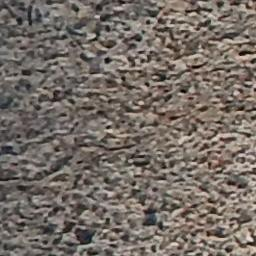
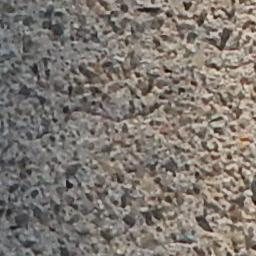
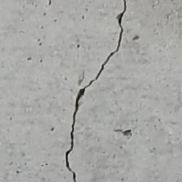
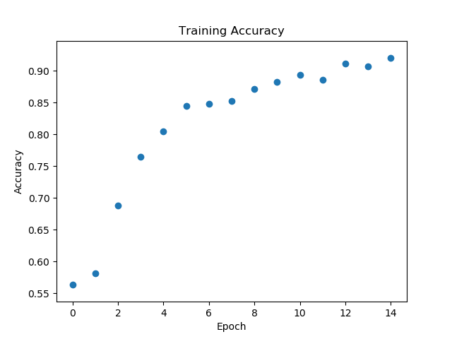
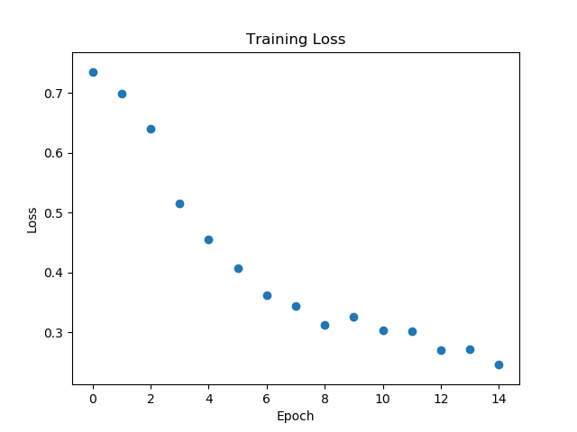
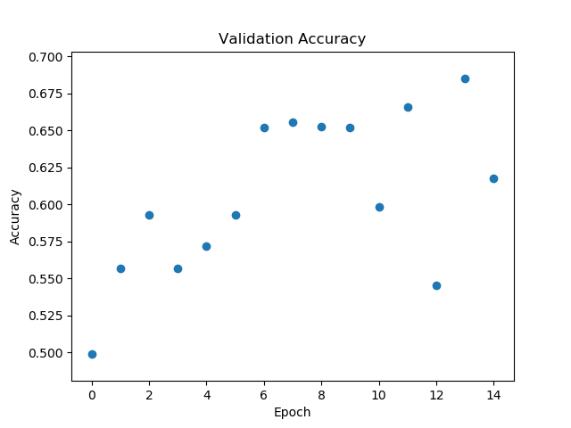
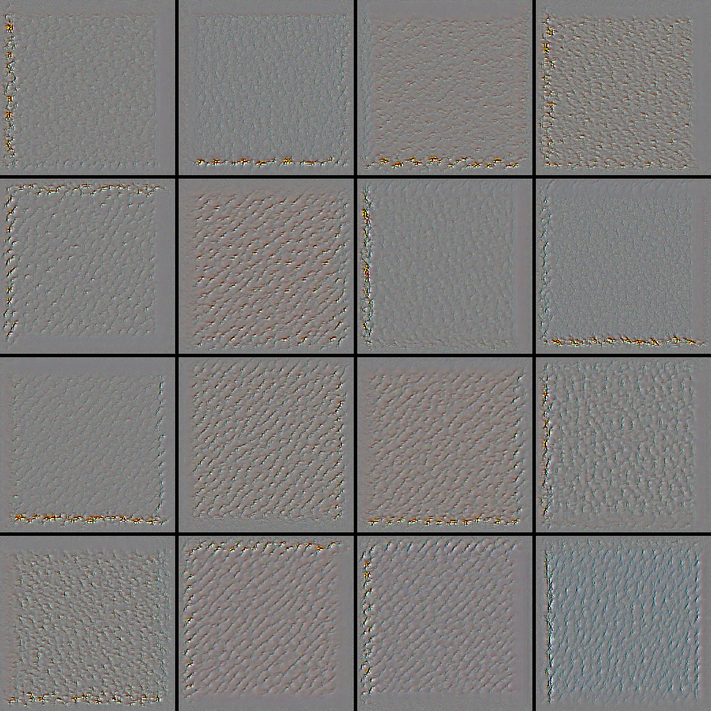
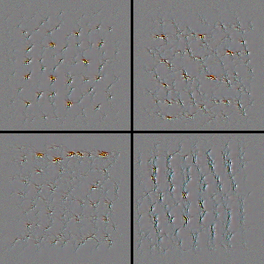

# Crack Detection
The purpose of this project was to train a neural net to detect if a picture of concrete contained a crack or not. This project was devised to help reduce time engineers spent on structures inspecting them.  Being able to detect and highlight cracks will not only save money it will increase safety.  

source: https://www.usbr.gov/lc/region/feature/gallery-rope-team/Beginning-the-descent.jpg

### Data
The data was sourced from the University of Utah and consists of labeled crack and no crack data.  The images are 256 X 256 with RGB color.  The images are of three differing types of structures bridges decks, walls, and pavement.  There are a few differing types of substrates used in the images.

##### Bridge Deck
Crack
  No Crack

##### Pavement
Crack
  No Crack

##### Wall
Crack
  No Crack

source: https://digitalcommons.usu.edu/all_datasets/48 

### Model - Convolutional Neural Net
For this project I decided to try and implement a neural net. A neural net is a deep learning tool that adds hidden layers into  model.  These layers add weights to the model that humans can have a tough time understanding.  

 Source: https://www.mathworks.com/videos/introduction-to-deep-learning-what-are-convolutional-neural-networks--1489512765771.html 

### Initial Neural Net
The initial net I decided to implement was based off the Keras image classification blog, https://blog.keras.io/building-powerful-image-classification-models-using-very-little-data.html.  The net consists of three convolution layers with relu activation functions, a dense layer with relu activation and 0.5 drop out and a final dense layer with a sigmoid activation function.

#### Model Performance
On paper this model looked great during training.  Accuracies ranged from 80-90%.  The issue was that the losses were high 1.5-1.8.  Upon digging into this I saw that I was only testing on no crack images.  This means I was getting only one guess on the test and train sets giving a high accuracy and high loss.

Once the test and train data generators were fixed for sending both classes of images in the model got 50% accuracy with lower losses of roughly 0.7.  This model made much more sense.  

### Back to the drawing board
The next model I built added complexity with two extra hidden layers and increased the number of filters at each layer of the model.  I believed this would help the model pick up on more features due to the differing aggregate used in the concrete.

#### Model Performance
This model performed some what better with accuracies of around 65% and losses at 0.6 with only 15 epochs.  This model performed much better and showed promise with the lower loss values.  

Look beautiful training

Not so great validation

#### Speculation about performance
I am only using 1000 of the 56,000 images.  This does not look to be enough for the network to pick up on the correct feature maps.  I suspect if I trained on a bigger set of the pictures my model would begin to pick up on these nuances in the data and would begin to perform better.  There is also quite a bit of noise in the data with the varying sizes of aggregate in the pictures.  

Lets look into the convolution layers to see if we can see anything that the model is picking up on.

First convolution layer

Second convolution layer

Third convolution layer

Forth convolution layer

##### What is the model misclassifying
The images are very 'noisy' they contain mostly dead image space with sparse cracks.  Looking though the images it appears that most edge cases get missed labeled.  It is also tough for the model to detect cracks when the concrete has aggregate base.  

##### GPU Issue!!

Tensorflow-gpu does not work out of the box with Nvidia's Cuda library version 10.0.  In order to get this to work I would have had to download Tensorflows source code and make edits to it.  It does however work for version 8 and 9 of the Nvidia Cuda libraries.  Also I tried the easy one step install Frank sent out and had no luck.  I will be un-installing my current Cuda version 10 with 8 or 9 during break.

### Future Work
* Run more images through the model, at least 10,000.
  * I believe this would allow for better classification.
* Look at existing papers that use this set of data.  I just found that there was some work done on this data last year
* Get my GPU working with tensorflow or use a different Keras backend.
* Apply network to an actual structure to see if I can identify cracked areas.   

Citations

Maguire, Marc; Dorafshan, Sattar; and Thomas, Robert J., "SDNET2018: A concrete crack image dataset for machine learning applications" (2018). Browse all Datasets. Paper 48.
https://digitalcommons.usu.edu/all_datasets/48

https://www.usbr.gov/lc/region/feature/gallery-rope-team/gallery.html
